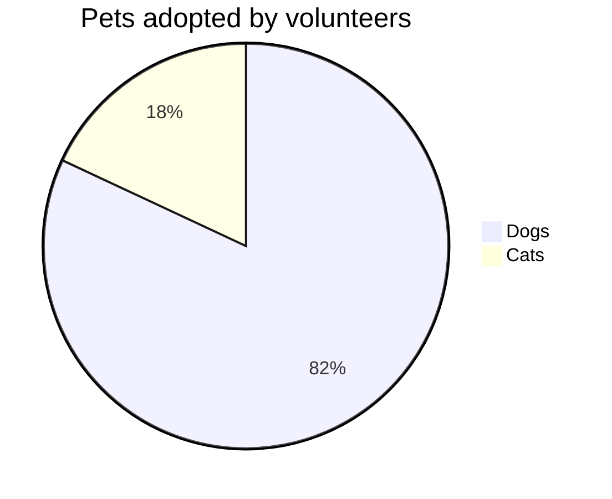

# Diagramas Estruturais
- diagrama de classes
- diagrama de objetos
- diagrama de pacotes
    - diagrama de modelos

# Diagramas Comportamentais
- caso de uso
- diagrama de fluxo de informação
- diagrama de atividade
    - estado inicial
    - estado final
    - atividade
    - flecha (fluxo)
    - decisão
    - raias
    - juncao (join)
    - bifurcacao (fork)
    - comentario
- diagrama de máquina de estado
    - diagrama de estado Comportamental da máquina
        - diagrama do protocolo de estado da máquina
- diagrama de interação
    - diagrama de sequência
    - diagrama de comunicação
    - diagrama de tempo
    - diagrama de visão de interação
