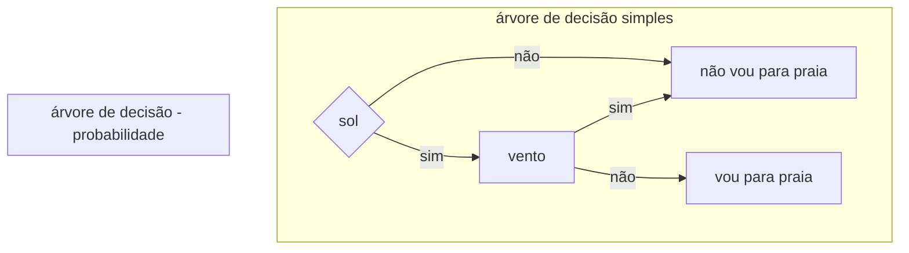

# sobre
lista de ferramentas voltadas a organização e estruturação em geral (desconsiderando a UML)

# lista
## abstração
- mapa conceitual
    - sobre
        - ferramenta gráfica que representa visualmente a organização e relação entre ideias e conceitos
    - estruturas
        - nó / conceito
        - link / conexão
            - representa a relação entre os dois conceitos 
        - palavra de transição
        - ramificação / subconceito
        - hierarquia / tópicos
        - mapa em teia / rede
- mapa mental
    - sobre
        - ferramenta para organizar ideias e conceitos de forma livre e criativa
    - estrutura
        - palavras-chaves
        - desenhos / imagens

## análise
- análise PESTEL
- análise de Cenários
- análise de Viabilidade
- análise de Stakeholders

## outros
- brainstorming
- bspm
- canvas de modelo de negócios
- cronograma
- design thinking
- diagrama de Casos de Uso
- diagrama de Gantt
- diagrama de Ishikawa
- diagrama de contexto
- diagrama de fluxo de dados
- diagrama de pert/cpmmm
- diagrama de sequencia
- fluxograma
- gráfico de Pareto
- heat map
- kanban
- lean Startup
- modelagem de Processos de Negócio (BPMN)
- prototipagem
- regra de negócio?
- SCRUM
- testes A/B
- user stories
- wireframes
    - partes fundamentais de um layout e elementos de uma interface
- árvore de Decisão
    - simplicação para tomada de decisões com base em probabilidade ou fatores

- árvore de Problemas

## matrizes
- matriz SWOT (FOFA)
```plantuml!
package "fatores positivos"{
    package opportunities{
    }
    package strengths{
    }
}
package "fatores negativos"{
    package weakenesses{
    }
    package threats{
    }
}
strengths --r-- weakenesses: internos
weakenesses -d[hidden]- threats
strengths -d[hidden]-> opportunities
opportunities --r-- threats: externos
```
    - objetivo de estudo
        - marca
        - loja
        - produto / serviço
        - rede social
        - ...
- matriz de Afinidade
- matriz de Análise de Fluxo de Valor
- matriz de Análise de Stakeholders
- matriz de Atributos (Matriz de Qualidade)
- matriz de Ciclo de Vida do Produto
- matriz de Compatibilidade
- matriz de Competitividade
- matriz de Competências
- matriz de Comunicação
- matriz de Custo x Benefício
- matriz de Decisão
- matriz de Decisão Multicritério
- matriz de Dependência x Impacto
- matriz de Envolvimento x Comprometimento
- matriz de Esforço x Impacto
- matriz de Esforço x Resultado
- matriz de Habilidade x Interesse
- matriz de Impacto x Urgência
- matriz de Interesse x Poder
- matriz de Matriz de Análise de Problemas
- matriz de Maturidade
- matriz de Pareto
- matriz de Priorização (GUT)
- matriz de Recursos x Dependências
- matriz de Responsabilidade (RACI)
- matriz de Risco (Matriz Probabilidade x Impacto)
- matriz de Seleção de Alternativas
- matriz de Seleção de Ideias
- matriz de Técnica x Função
- matriz de Validação x Verificação
- matriz de Visão Geral do Projeto

# arquitetura de software
- modelo em Arquitetura Baseada em Fluxo de Dados (Data Flow-Based Architecture)
- modelo em Camadas (Layered Architecture)
- modelo em Componentes (Component-Based Architecture)
- modelo em Eventos (Event-Driven Architecture)
- modelo em Microserviços (Microservices Architecture)
- modelo em Nuvem (Cloud-Based Architecture)
- modelo em Orientação a Objetos (Object-Oriented Architecture)
- modelo em Pipeline (Pipeline Architecture)
- modelo em Serviços Web (Service-Oriented Architecture - SOA)
