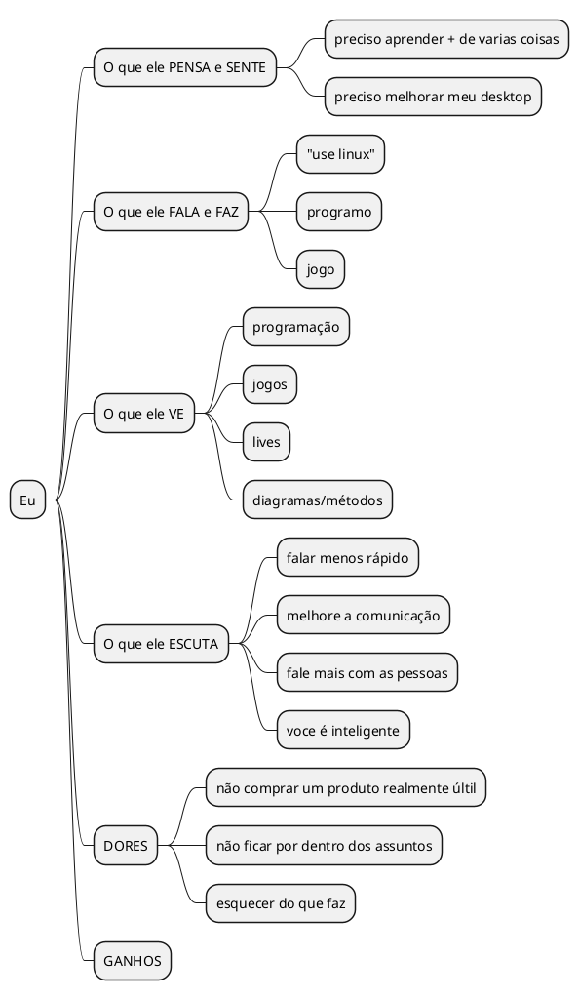
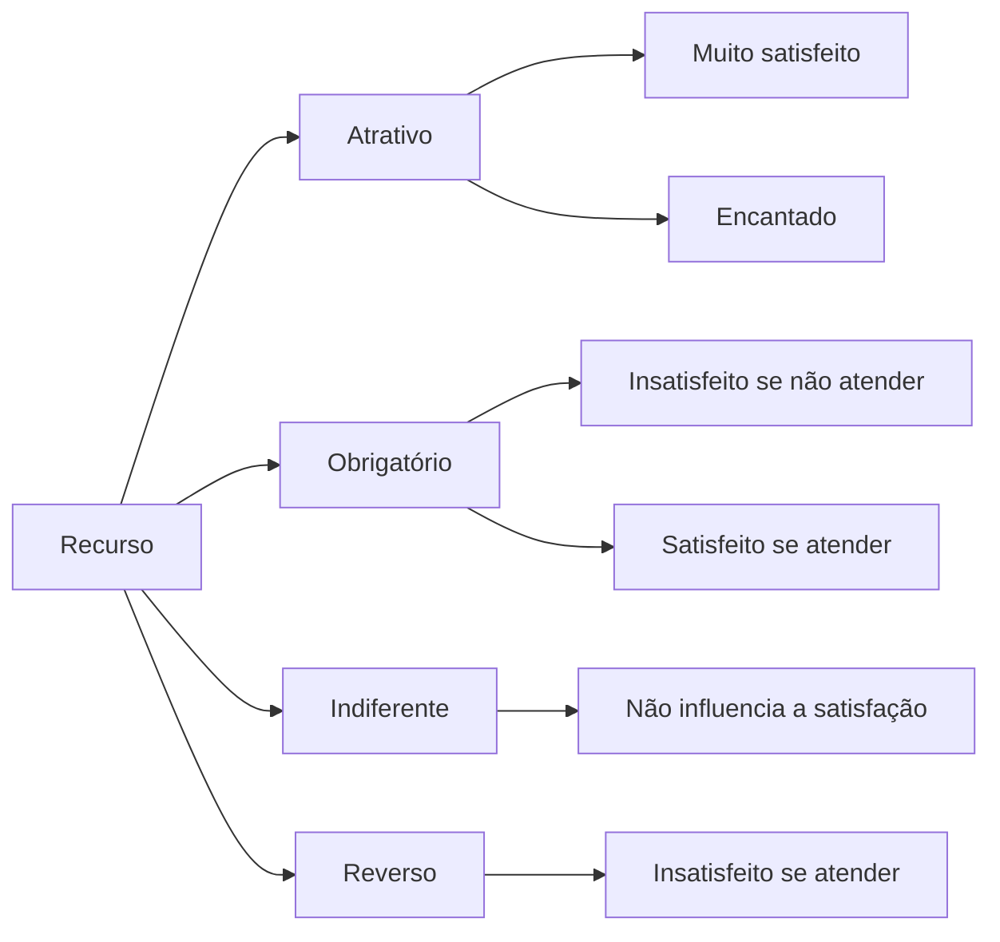
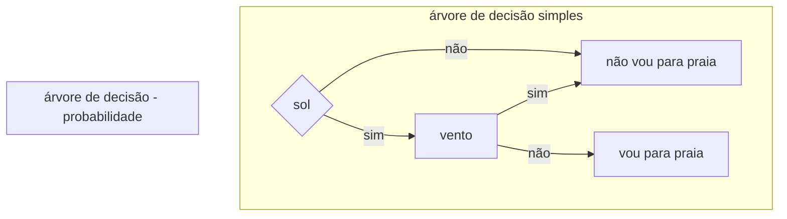

# sobre
lista de ferramentas voltadas a organização e estruturação em geral (desconsiderando a UML)

# lista
## abstração
- mapa conceitual
    - sobre
        - ferramenta gráfica que representa visualmente a organização e relação entre ideias e conceitos
    - estruturas
        - nó / conceito
        - link / conexão
            - representa a relação entre os dois conceitos 
        - palavra de transição
        - ramificação / subconceito
        - hierarquia / tópicos
        - mapa em teia / rede
- mapa mental
    - sobre
        - ferramenta para organizar ideias e conceitos de forma livre e criativa
    - estrutura
        - palavras-chaves
        - desenhos / imagens

## análise
- análise PESTEL / PESTAL
    - estrutura
        - politica
            - como politicas governamentais podem afetar
        - economia
            - como condições econômicas podem afetar
        - sociedade
            - como tendencias culturais ou sociais podem afetar
        - tecnologia
            - inovações / mudanças tecnológicas podem afetar
        - ecológico
            - questões ambientais podem afetar
                - mudança climática
        - legal
            - como leis, regulamentações e suas mudanças podem afetar
- análise de Cenários
- análise de Viabilidade
- análise de Stakeholders

## outros
- bsc
- 5W
    - estrutura
        - what
        - why
        - where
        - when
        - who
        - how
        - how much
- brainstorming
- mapa de empatia


- matriz de Kano
    - sobre
        - exemplifica as reais necessidades x atratividades de algo, como objeto ou até ação, assim mensurando a qualidade
    - estrutura

- tabela de Kano
- bspm
- canvas de modelo de negócios
- cronograma
- design thinking
- diagrama de Casos de Uso
- diagrama de Gantt
- diagrama de Ishikawa
- diagrama de contexto
- diagrama de fluxo de dados
- diagrama de PERT/CPMMM
- diagrama de sequencia
- fluxograma
- gráfico de Pareto
- heat map
- kanban
    - estrutura
        - fazer
        - fazendo
        - feito
- lean Startup
- modelagem de Processos de Negócio (BPMN)
- prototipagem
- regra de negócio?
- SCRUM
- testes A/B
- user stories
- wireframes
    - partes fundamentais de um layout e elementos de uma interface
- árvore de Decisão
    - sobre
        - simplicação para tomada de decisões com base em probabilidade ou fatores
    - exemplo

- árvore de Problemas

## matrizes
- matriz SWOT / FOFA / SWOT Pessoal
    - sobre
        - analisa como os fatores positivos podem crescer
        - analisa como os fatores negativos podem diminuir ou serem controladas
    - exemplo
```plantuml!
package "fatores positivos"{
    package opportunities{
    }
    package strengths{
    }
}
package "fatores negativos"{
    package weakenesses{
    }
    package threats{
    }
}
strengths -r- weakenesses: internos
weakenesses -d[hidden]- threats
strengths -d[hidden]-> opportunities
opportunities -r- threats: externos
```
    - estrutura
        - especificar objetivo de estudo
            - marca
            - loja
            - produto / serviço
            - rede social
            - você mesmo
            - ...
- matriz de Afinidade
- matriz de Análise de Fluxo de Valor
- matriz de Análise de Stakeholders
- matriz de Atributos (Matriz de Qualidade)
- matriz de Ciclo de Vida do Produto
- matriz de Compatibilidade
- matriz de Competitividade
- matriz de Competências
    - sobre
        - visa verificar as competencias e saber o que precisa ser "equilibrado"
    - estrutura
        - agrupar competencias como categorias / colunas
    - exemplo

|Funcionario|Java|HTML|
|-|:-:|:-:|
|Fulano||x|
|Renato Nunes |x|x|

- matriz de Comunicação
- matriz de Custo x Benefício
- matriz de Decisão
- matriz de Decisão Multicritério
- matriz de Dependência x Impacto
- matriz de Envolvimento x Comprometimento
- matriz de Esforço x Impacto
- matriz de Esforço x Resultado
- matriz de Habilidade x Interesse
- matriz de Impacto x Urgência
- matriz de Interesse x Poder
- matriz de Matriz de Análise de Problemas
- matriz de Maturidade
- matriz de Pareto
- matriz de Priorização (GUT)
- matriz de Recursos x Dependências
- matriz de Responsabilidade (RACI)
- matriz de Risco (Matriz Probabilidade x Impacto)
- matriz de Seleção de Alternativas
- matriz de Seleção de Ideias
- matriz de Técnica x Função
- matriz de Validação x Verificação
- matriz de Visão Geral do Projeto

# arquitetura de software
- modelo em Arquitetura Baseada em Fluxo de Dados (Data Flow-Based Architecture)
- modelo em Camadas (Layered Architecture)
- modelo em Componentes (Component-Based Architecture)
- modelo em Eventos (Event-Driven Architecture)
- modelo em Microserviços (Microservices Architecture)
- modelo em Nuvem (Cloud-Based Architecture)
- modelo em Orientação a Objetos (Object-Oriented Architecture)
- modelo em Pipeline (Pipeline Architecture)
- modelo em Serviços Web (Service-Oriented Architecture - SOA)

# Referencias
- [BlogAbriMinhaEmpresa](https://www.youtube.com/@BlogAbriMinhaEmpresa/videos)
- [dynamicsme2346](https://www.youtube.com/@dynamicsme2346/videos)
