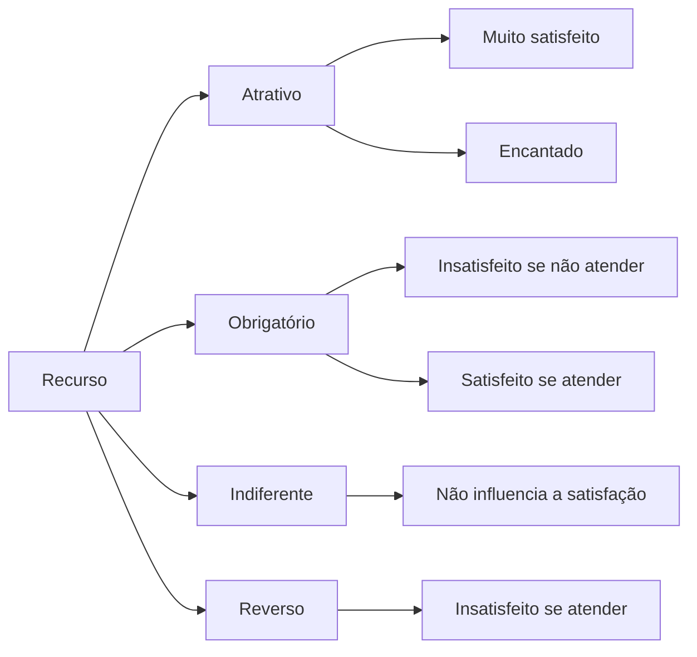

# sobre
exemplifica as reais necessidades x atratividades de algo, como objeto ou até ação, assim mensurando a qualidade
# tabela
## sobre

## ordem de funcionamento
1. organize as perguntas
2. para cada pergunta crie uma tabela
3. crie uma tabela com base nas respostas
4. cálculo de coeficiente de satisfação e insatisfação

## estrutura
### pergunta e resposta
#### funcional
- Como você se sente por tal coisa
    1. eu gosto desta maneira
    2. eu espero que seja desta maneira
    3. eu fico neutro
    4. eu posso aceitar que seja desta maneira
    5. eu não gosto disto desta maneira

#### disfuncional
- o mesmo de funcional mas sendo "negativo"

|:Pergunta:||:Disfuncional:||||||
|^^||1.|2.|3.|4.|5.|
|:Funcional:|1.|Q|A|A|A|U|
|^^|2.|A|A|A|U|U|
|^^|3.|Q|A|A|A|U|
|^^|4.|Q|A|A|A|U|
|^^|5.|Q|A|A|A|U|

##### legenda
- q
    - questionável
- a
    - atrativo
- u
    - reverso
- o
    - obrigatório

#### cálculo de coeficiente de satisfação e insatisfação
- caso a pesquisa seja de vários clientes/pessoas, terá de criar em base de porcentagem a média para aplicar nas fórmulas

##### satisfação
$ CS = \frac{A+U}{A+U+O+N} $

##### insatisfação
$ CS = \frac{O+U}{A+U+O+N} $

# estrutura simplificada
## sobre
apenas para enxugar os conceitos para futuros usos

## legenda
- Recurso
    - aquilo que deseja estudar, como produto, ação, pessoas...
- Obrigatório
    - requisitos considerados básicos
    - não gera aumento de satisfação
    - a ausência gera insatisfação

